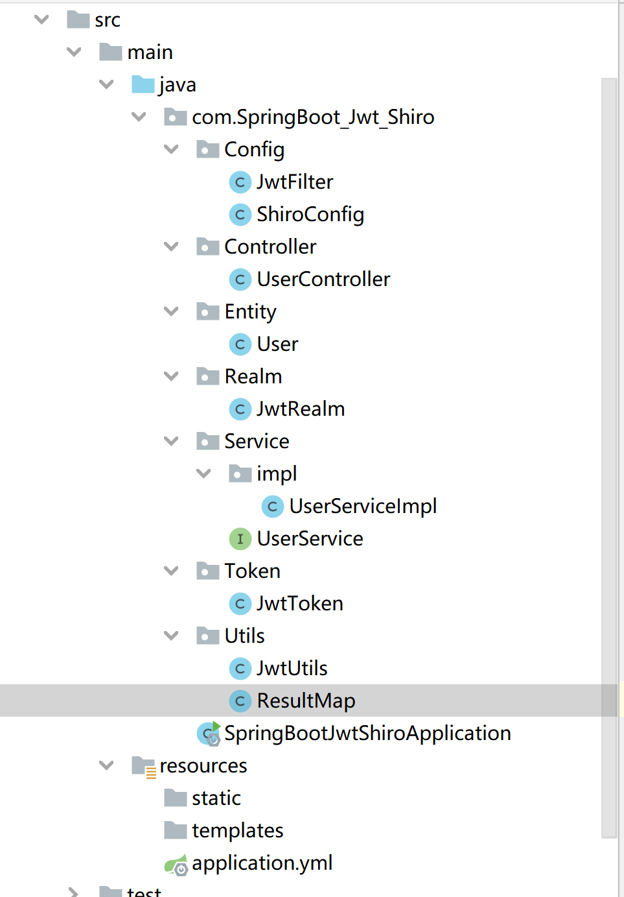

这是一个非常简单的示例，有助于帮助初学者搞清楚一整套前后端分离原理

第一步请创建一个数据库

```sql
create database shiro_jwt;
use shiro_jwt;
create table user(
    id int not null primary key auto_increment,
    username nvarchar(128) not null ,
    password nvarchar(128) not null ,
    role nvarchar(256) not null ,
    permission nvarchar(256) not null
);

select * from shiro_jwt.user;

insert into user (username, password, role, permission)
values ('Admin','admin','admin','user:add:*');

insert into user (username, password, role, permission)
values ('Guest','gust','guest','user:guest:*');
```

数据库密码请到后端的`resources\application.yml`进行修改

*前端默认端口8080*

*后端默认端口80*

*无必要请勿修改*

#### 前端展示:


#### 后端模型：

- Config
  - 配置自定义过滤器，和Shiro的简单配置
- Controller
  - 前后端交互接口
- Entity
  - 映射数据库字段实体类
- Realm
  - 自定义权限管理
- Service
  - 用户的基本操作
- Token
  - 重写Shiro的Token认证
- Utils
  - JWT加密和一些简单工具



#### 前端模型：


- DataList.vue
  - 查询用户角色页面
- Login.vue
  - 登录页面
- Manager.vue
  - 导航页面

